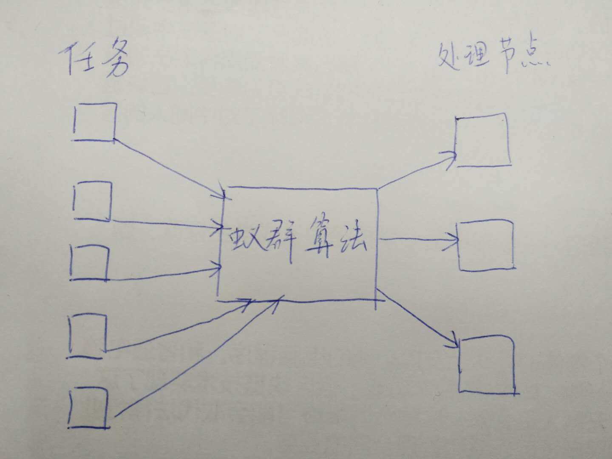
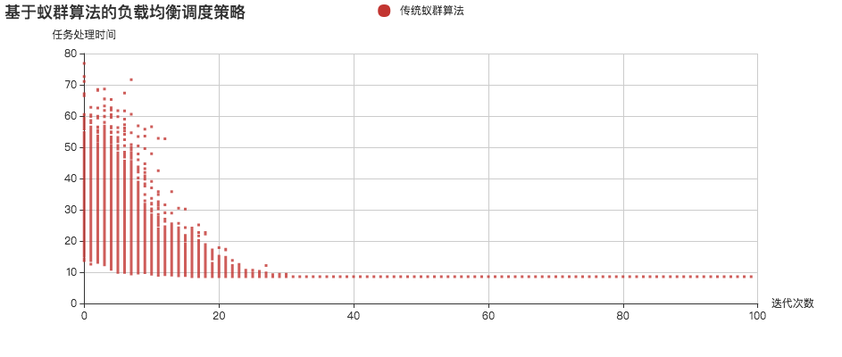

> 蚂蚁几乎没有视力，但他们却能够在黑暗的世界中找到食物，而且能够找到一条从洞穴到食物的最短路径。它们是如何做到的呢？

## 蚂蚁寻找食物的过程
单只蚂蚁的行为及其简单，行为数量在10种以内，但成千上万只蚂蚁组成的蚁群却能拥有巨大的智慧，这离不开它们信息传递的方式——信息素。

蚂蚁在行走过程中会释放一种称为“信息素”的物质，用来标识自己的行走路径。在寻找食物的过程中，根据信息素的浓度选择行走的方向，并最终到达食物所在的地方。

信息素会随着时间的推移而逐渐挥发。

在一开始的时候，由于地面上没有信息素，因此蚂蚁们的行走路径是随机的。蚂蚁们在行走的过程中会不断释放信息素，标识自己的行走路径。随着时间的推移，有若干只蚂蚁找到了食物，此时便存在若干条从洞穴到食物的路径。由于蚂蚁的行为轨迹是随机分布的，因此在单位时间内，短路径上的蚂蚁数量比长路径上的蚂蚁数量要多，从而蚂蚁留下的信息素浓度也就越高。这为后面的蚂蚁们提供了强有力的方向指引，越来越多的蚂蚁聚集到最短的路径上去。

## 什么是蚁群算法？
蚁群算法就是模拟蚂蚁寻找食物的过程，它能够求出从原点出发，经过若干个给定的需求点，最终返回原点的最短路径。这也就是著名的旅行商问题(Traveling Saleman Problem，TSP)。

本文使用蚁群算法来解决分布式环境下的负载均衡调度问题。

## 蚁群算法的应用——负载均衡调度
集群模式是目前较为常用的一种部署结构，也就是当单机处理能力无法满足业务需求，那么就增加处理节点，并由一个负载均衡器负责请求的调度。然而对于一个庞大系统而言，情况往往比较复杂。集群中节点的处理能力往往各不相同，而且不同任务的处理复杂度也不尽相同。那么负载均衡器如何进行任务分配，使得集群性能达到最优？资源利用率达到最高呢？这是一个极具挑战又很有价值的问题。

// TODO 增加目前的负载均衡调度算法的优缺点分析

本文我们就采用蚁群算法来解决这一问题。

## 数学建模
在开始之前，我们首先需要将“负载均衡调度”这个问题进行数学建模，量化各项指标，并映射到蚁群算法中。

## 问题描述
> 求一种最优的任务分配策略，能够将N个长度不等的任务按照某一种策略分配给M个处理能力不同的服务器节点，并且N个任务的完成时间最短。

在这个问题中，我们将所有任务的完成时间作为衡量分配策略优良的指标。每一种分配策略都是这个问题的一个可行解。那么具有最小完成时间的分配策略就是这个问题的最优解。




## 参数定义
```js
var tasks = [];
var taskNum = 100;
```
- tasks：任务数组，数组的下标表示任务的编号，数组的值表示任务的长度。比如：tasks[0]=10表示第一个任务的任务长度是10.
- taskNum：任务的数量，也就是tasks数组的长度。这里为了提高代码的可读性才专门使用taskNum来表示任务数量。

```js
var nodes = [];
var nodeNum = 10;
```
- nodes：处理节点的数组。数组的下标表示处理节点的编号，数组值表示节点的处理速度。比如：nodes[0]=10表示第1个处理节点的处理速度为10.
- nodeNum：处理节点的数量，也就是nodes数组的长度。这里也是为了提高代码的可读性才专门使用nodeNum来表示节点的数量。

```js
var iteratorNum;
var antNum;
```
- iteratorNum：蚁群算法一共需要迭代的次数，每次迭代都有antNum只蚂蚁进行任务分配。
- antNum：每次迭代中蚂蚁的数量。每只蚂蚁都是一个任务调度者，每次迭代中的每一只蚂蚁都需要完成所有任务的分配，这也就是一个可行解。

```js
var timeMatrix = [];
```
- 任务处理时间矩阵。
    - 它是一个二维矩阵。比如：timeMatrix[i][j]就表示第i个任务分配给第j个节点所需的处理时间。
    - 这个矩阵是基于tasks数组和nodes数组计算而来的。比如task[i]表示第i个任务的任务长度，nodes[j]表示第j个节点的处理速度。所以，timeMatrix[i][j]=task[i]/nodes[j].
    
```js
var pheromoneMatrix = [];
var maxPheromoneMatrix = [];
var criticalPointMatrix = [];
```
- pheromoneMatrix：信息素矩阵
    - 它是一个二维矩阵，用于记录任务i分配给节点j这条路径上的信息素浓度。
    - 比如：pheromoneMatrix[i][j]=0.5就表示任务i分配给节点j这条路径上的信息素浓度为0.5
- maxPheromoneMatrix：pheromoneMatrix矩阵的每一行中最大信息素的下标。
    - 比如：maxPheromoneMatrix[0]=5表示pheromoneMatrix第0行的所有信息素中，最大信息素的下标是5.
- criticalPointMatrix：在一次迭代中，采用随机分配策略的蚂蚁的临界编号。
    - 比如：如果将蚂蚁数量设为10，那么每次迭代中都有10只蚂蚁完成所有任务的分配工作。并且分配过程是按照蚂蚁编号从小到大的顺序进行的(蚂蚁从0开始编号)。如果criticalPointMatrix[0]=5，那么也就意味着，在分配第0个任务的时候，编号是0～5的蚂蚁根据信息素浓度进行任务分配(即：将任务分配给本行中信息素浓度最高的节点处理)，6～9号蚂蚁则采用随机分配的方式(即：将任务随机分配给任意一个节点处理)。
    - **为什么要这么做？**
    如果每只蚂蚁都将任务分配给信息素浓度最高的节点处理，那么就会出现停滞现象。也就是算法过早地收敛至一个局部最优解，无法发现全局最优解。
    因此需要一部分蚂蚁遵循信息素最高的分配策略，还需要一部分蚂蚁遵循随机分配的策略，以发现新的局部最优解。

```js
var p = 0.5;
var q = 2;
```
- p：每完成一次迭代后，信息素衰减的比例。
我们知道，在真实的蚁群中，蚂蚁分泌的信息素会随着时间的推移而渐渐衰减。那么在算法中，我们使得信息素每完成一次迭代后进行衰减，但在一次迭代过程中，信息素浓度保持不变。
- q：蚂蚁每次经过一条路径，信息素增加的比例。
我们也知道，在真实的蚁群中，蚂蚁会在行进过程中分泌信息素。那么在算法中，我们使得算法每完成一次迭代后，就将蚂蚁经过的路径上增加信息素q，但在一次迭代过程中，信息素浓度不变。


## 算法初始化
```js
// 初始化任务集合
tasks = initRandomArray(_taskNum, taskLengthRange);

// 初始化节点集合
nodes = initRandomArray(_nodeNum, nodeSpeendRange);
```
在正式开始之前，我们需要初始化任务数组和节点数组。这里采用随机赋值的方式，我们给tasks随机创建100个任务，每个任务的长度是10～100之间的随机整数。再给nodes随机创建10个节点，每个节点的处理速度是10～100之间的随机整数。

OK，准备工作完成，下面来看蚁群算法的实现。

## 蚁群算法
```js
/**
 * 蚁群算法
 */
function aca() {
    // 初始化任务执行时间矩阵
    initTimeMatrix(tasks, nodes);

    // 初始化信息素矩阵
    initPheromoneMatrix(taskNum, nodeNum);

    // 迭代搜索
    acaSearch(iteratorNum, antNum);
}
```
正如你所看到的，蚁群算法并不复杂，总体而言就是这三部：

- 初始化任务执行时间矩阵
- 初始化信息素矩阵
- 迭代搜索

当然，第一第二步都较为简单，相对复杂的代码在“迭代搜索”中。那么下面我们就分别来看一下这三个步骤的实现过程。

## 初始化任务执行时间矩阵
```js
/**
 * 初始化任务处理时间矩阵
 * @param tasks 任务(长度)列表
 * @param nodes 节点(处理速度)列表
 */
function initTimeMatrix(tasks, nodes) {
    for (var i=0; i<tasks.length; i++) {
        // 分别计算任务i分配给所有节点的处理时间
        var timeMatrix_i = [];
        for (var j=0; j<nodes.length; j++) {
            timeMatrix_i.push(tasks[i] / nodes[j]);
        }
        timeMatrix.push(timeMatrix_i);
    }
}
```
通过上文的学习我们已经知道，当任务长度数组tasks和节点处理速度数组nodes确定下来后，所有任务的执行时间都是可以确定下来了，用公式tasks[i]/nodes[j]计算一下即可，也就是“时间=长度/速度”，小学数学知识。OK，那么timeMatrix矩阵的计算也就是这样。

这里再次介绍下timeMatrix矩阵的含义：timeMatrix[i][j]表示任务i分配给节点j处理所需要的时间，其计算公式也就是：
```js
timeMatrix[i][j] = tasks[i]/nodes[j]
```

## 初始化信息素矩阵
```js
/**
 * 初始化信息素矩阵(全为1)
 * @param taskNum 任务数量
 * @param nodeNum 节点数量
 */
function initPheromoneMatrix(taskNum, nodeNum) {
    for (var i=0; i<taskNum; i++) {
        var pheromoneMatrix_i = [];
        for (var j=0; j<nodeNum; j++) {
            pheromoneMatrix_i.push(1);
        }
        pheromoneMatrix.push(pheromoneMatrix_i);
    }
}
```
初始化信息素矩阵也就是将信息素矩阵中所有元素置为1.

这里再次重申一下信息素矩阵的含义，pheromoneMatrix[i][j]表示将任务i分配给节点j这条路径的信息素浓度。

> 注意：我们将负载均衡调度过程中的一次任务分配当作蚁群算法中一条路径。如：我们将“任务i分配给节点j”这一动作，当作蚂蚁从任务i走向节点j的一条路径。因此，pheromoneMatrix[i][j]就相当于i——>j这条路径上的信息素浓度。

## 迭代搜索过程
```js
/**
 * 迭代搜索
 * @param iteratorNum 迭代次数
 * @param antNum 蚂蚁数量
 */
function acaSearch(iteratorNum, antNum) {
    for (var itCount=0; itCount<iteratorNum; itCount++) {
        // 本次迭代中，所有蚂蚁的路径
        var pathMatrix_allAnt = [];

        for (var antCount=0; antCount<antNum; antCount++) {
            // 第antCount只蚂蚁的分配策略(pathMatrix[i][j]表示第antCount只蚂蚁将i任务分配给j节点处理)
            var pathMatrix_oneAnt = initMatrix(taskNum, nodeNum, 0);
            for (var taskCount=0; taskCount<taskNum; taskCount++) {
                // 将第taskCount个任务分配给第nodeCount个节点处理
                var nodeCount = assignOneTask(antCount, taskCount, nodes, pheromoneMatrix);
                pathMatrix_oneAnt[taskCount][nodeCount] = 1;
            }
            // 将当前蚂蚁的路径加入pathMatrix_allAnt
            pathMatrix_allAnt.push(pathMatrix_oneAnt);
        }

        // 计算 本次迭代中 所有蚂蚁 的任务处理时间
        var timeArray_oneIt = calTime_oneIt(pathMatrix_allAnt);
        // 将本地迭代中 所有蚂蚁的 任务处理时间加入总结果集
        resultData.push(timeArray_oneIt);

        // 更新信息素
        updatePheromoneMatrix(pathMatrix_allAnt, pheromoneMatrix, timeArray_oneIt);
    }
}
```
这个过程略微复杂，但也还好，且听我一一道来。

在整个蚁群算法中，一共要进行iteratorNum次迭代。每一次迭代都会产生当前的最优分配策略，也就是“局部最优解”。迭代的次数越多，那么局部最优解就越接近于全局最优解。但是，迭代次数过多会造成负载均衡器大量的时间和性能上的开销，从而无法满足海量任务的调度。但迭代次数太少了，可能得到的并不是全局最优解。那么这个问题如何解决呢？有两种办法：

1. 限定迭代次数
为了避免过多的迭代，我们可以事先设置一个迭代次数，从而迭代了这么多次后，就把当前的局部最优解当作全局最优解。
2. 设置误差允许范围
我们还可以事先设置一个允许的误差范围。当迭代N此后，当前最优的任务处理时间在这个允许范围之内了，那么就停止迭代。

这两种方式各有千秋，我们这里选择第一种——限定迭代次数。并且将迭代次数限定为1000次。

> 注意：收敛速度也是衡量算法优良的一个重要指标。比如算法1迭代10次就能找到全局最优解，而算法2迭代1000次才能找到全局最优解。所以算法1的收敛速度要优于算法2.

下面介绍上述算法的执行流程。

蚁群算法一共要进行iteratorNum次迭代，每次迭代中，所有蚂蚁都需要完成所有任务的分配。因此上述算法采用了三层for循环，第一层用于迭代次数的循环，在本算法中一共要循环1000次；第二层用于蚂蚁的循环，本算法一共有10只蚂蚁，因此需要进行10次循环；第三层用于所有任务的循环，本算法一共有100个任务，因此需要循环100次，每一次循环，都将当前任务按照某一种策略分配给某一个节点，并在pathMatrix_oneAnt矩阵中记录蚂蚁的分配策略。

pathMatrix_oneAnt是一个二维矩阵，所有元素要么是0要么是1.比如：pathMatrix_oneAnt[i][j]=1就表示当前蚂蚁将任务i分配给了节点j处理，pathMatrix_oneAnt[i][j]=0表示任务i没有分配给节点j处理。该矩阵的每一行都有且仅有一个元素为1，其他元素均为0.

每一只蚂蚁当完成这100个任务的分配之后，就会产生一个pathMatrix_oneAnt矩阵，用于记录该只蚂蚁的分配策略。那么当10只蚂蚁均完成任务的分配后，就会产生一个pathMatrix矩阵。这是一个三维矩阵，第一维记录了蚂蚁的编号，第二维表示任务的下标，第三维表示节点的编号，从而pathMatrix[x][i][j]=1就表示编号为x的蚂蚁将任务i分配给了节点j处理；pathMatrix[x][i][j]=0就表示编号为x的蚂蚁没有将任务i分配给了节点j处理。

这10只蚂蚁完成一次任务的分配也被称为一次迭代。每完成一次迭代后，都要使用calTime_oneIt函数在计算本次迭代中，所有蚂蚁的任务处理时间，并记录在timeArray_oneIt矩阵中。

在每次迭代完成前，还需要使用updatePheromoneMatrix函数来更新信息素矩阵。

下面就分别详细介绍迭代搜索过程中的三个重要函数：

- 任务分配函数：assignOneTask
- 任务处理时间计算函数：calTime_oneIt
- 更新信息素函数：updatePheromoneMatrix

## 任务分配函数
```js
/**
 * 将第taskCount个任务分配给某一个节点处理
 * @param antCount 蚂蚁编号
 * @param taskCount 任务编号
 * @param nodes 节点集合
 * @param pheromoneMatrix 信息素集合
 */
function assignOneTask(antCount, taskCount, nodes, pheromoneMatrix) {

    // 若当前蚂蚁编号在临界点之前，则采用最大信息素的分配方式
    if (antCount <= criticalPointMatrix[taskCount]) {
        return maxPheromoneMatrix[taskCount];
    }

    // 若当前蚂蚁编号在临界点之后，则采用随机分配方式
    return random(0, nodeNum-1);
}
```

任务分配函数负责将一个指定的任务按照某种策略分配给某一节点处理。分配策略一共有两种：

1. 按信息素浓度分配
也就是将任务分配给本行中信息素浓度最高的节点处理。比如：当前的任务编号是taskCount，当前的信息素浓度矩阵是pheromoneMatrix，那么任务将会分配给pheromoneMatrix[taskCount]这一行中信息素浓度最高的节点。

2. 随机分配
将任务随意分配给某一个节点处理。

那么，这两种分配策略究竟如何选择呢？答案是——根据当前蚂蚁的编号antCount。

通过上文可知，矩阵criticalPointMatrix用于记录本次迭代中，采用不同分配策略的蚂蚁编号的临界点。比如：criticalPointMatrix[i]=5就表示编号为0～5的蚂蚁在分配任务i的时候采用“按信息素浓度”的方式分配(即：将任务i分配给信息素浓度最高的节点处理)；而编号为6～9的蚂蚁在分配任务i时，采用随机分配策略。

## 计算任务处理时间
```js
/**
 * 计算一次迭代中，所有蚂蚁的任务处理时间
 * @param pathMatrix_allAnt 所有蚂蚁的路径
 */
function calTime_oneIt(pathMatrix_allAnt) {
    var time_allAnt = [];
    for (var antIndex=0; antIndex<pathMatrix_allAnt.length; antIndex++) {
        // 获取第antIndex只蚂蚁的行走路径
        var pathMatrix = pathMatrix_allAnt[antIndex];

        // 获取处理时间最长的节点 对应的处理时间
        var maxTime = -1;
        for (var nodeIndex=0; nodeIndex<nodeNum; nodeIndex++) {
            // 计算节点taskIndex的任务处理时间
            var time = 0;
            for (var taskIndex=0; taskIndex<taskNum; taskIndex++) {
                if (pathMatrix[taskIndex][nodeIndex] == 1) {
                    time += timeMatrix[taskIndex][nodeIndex];
                }
            }
            // 更新maxTime
            if (time > maxTime) {
                maxTime = time;
            }
        }

        time_allAnt.push(maxTime);
    }
    return time_allAnt;
}
```

每完成一次迭代，都需要计算本次迭代中所有蚂蚁的行走路径(即：所有蚂蚁的任务处理之间)，并记录在time_allAnt矩阵中。

在实际的负载均衡调度中，各个节点的任务处理是并行计算的，所以，所有任务的完成时间应该是所有节点任务完成时间的最大值，并非所有任务完成时间的总和。

每完成一次迭代，就会产生一个time_allAnt矩阵，并且加入resultData矩阵中。当算法完成所有迭代后，所有蚂蚁的所有任务处理时间都被记录在resultData矩阵中，它是一个二维矩阵。比如：resultData[x][y]=10代表第x次迭代中第y只蚂蚁的任务处理时间是10.


## 更新信息素
```js
/**
 * 更新信息素
 * @param pathMatrix_allAnt 本次迭代中所有蚂蚁的行走路径
 * @param pheromoneMatrix 信息素矩阵
 * @param timeArray_oneIt 本次迭代的任务处理时间的结果集
 */
function updatePheromoneMatrix(pathMatrix_allAnt, pheromoneMatrix, timeArray_oneIt) {
    // 所有信息素均衰减p%
    for (var i=0; i<taskNum; i++) {
        for (var j=0; j<nodeNum; j++) {
            pheromoneMatrix[i][j] *= p;
        }
    }

    // 找出任务处理时间最短的蚂蚁编号
    var minTime = Number.MAX_VALUE;
    var minIndex = -1;
    for (var antIndex=0; antIndex<antNum; antIndex++) {
        if (timeArray_oneIt[antIndex] < minTime) {
            minTime = timeArray_oneIt[antIndex];
            minIndex = antIndex;
        }
    }

    // 将本次迭代中最优路径的信息素增加q%
    for (var taskIndex=0; taskIndex<taskNum; taskIndex++) {
        for (var nodeIndex=0; nodeIndex<nodeNum; nodeIndex++) {
            if (pathMatrix_allAnt[minIndex][taskIndex][nodeIndex] == 1) {
                pheromoneMatrix[taskIndex][nodeIndex] *= q;
            }
        }
    }

    maxPheromoneMatrix = [];
    criticalPointMatrix = [];
    for (var taskIndex=0; taskIndex<taskNum; taskIndex++) {
        var maxPheromone = pheromoneMatrix[taskIndex][0];
        var maxIndex = 0;
        var sumPheromone = pheromoneMatrix[taskIndex][0];
        var isAllSame = true;

        for (var nodeIndex=1; nodeIndex<nodeNum; nodeIndex++) {
            if (pheromoneMatrix[taskIndex][nodeIndex] > maxPheromone) {
                maxPheromone = pheromoneMatrix[taskIndex][nodeIndex];
                maxIndex = nodeIndex;
            }

            if (pheromoneMatrix[taskIndex][nodeIndex] != pheromoneMatrix[taskIndex][nodeIndex-1]){
                isAllSame = false;
            }

            sumPheromone += pheromoneMatrix[taskIndex][nodeIndex];
        }

        // 若本行信息素全都相等，则随机选择一个作为最大信息素
        if (isAllSame==true) {
            maxIndex = random(0, nodeNum-1);
            maxPheromone = pheromoneMatrix[taskIndex][maxIndex];
        }

        // 将本行最大信息素的下标加入maxPheromoneMatrix
        maxPheromoneMatrix.push(maxIndex);

        // 将本次迭代的蚂蚁临界编号加入criticalPointMatrix(该临界点之前的蚂蚁的任务分配根据最大信息素原则，而该临界点之后的蚂蚁采用随机分配策略)
        criticalPointMatrix.push(Math.round(antNum * (maxPheromone/sumPheromone)));
    }
}
```

每完成一次迭代，都需要更新信息素矩阵，这个函数的包含了如下四步：

1. 将所有信息素浓度降低p%
这个过程用来模拟信息素的挥发。

2. 找出本次迭代中最短路径，并将该条路径的信息素浓度提高q%
每次迭代，10只蚂蚁就会产生10条路径(即10种任务分配策略)，我们需要找出最短路径，并将该条路径的信息素浓度提高。

3. 更新maxPheromoneMatrix矩阵
步骤1和步骤2完成后，信息素矩阵已经更新完毕。接下来需要基于这个最新的信息素矩阵，计算每行最大信息素对应的下标，即：maxPheromoneMatrix矩阵。通过上文可知，该矩阵供函数assignOneTask在分配任务时使用。

4. 更新criticalPointMatrix矩阵
紧接着需要更新criticalPointMatrix矩阵，记录采用何种任务分配策略的蚂蚁临界编号。
比如：信息素矩阵第0行的元素为pheromoneMatrix[0]={1,3,1,1,1,1,1,1,1,1}，那么criticalPointMatrix[0]的计算方式如下：
    - 计算最大信息素的概率：最大信息素/该行所有信息素之和
        - 3/(1+3+1+1+1+1+1+1+1+1)=0.25
    - 计算蚂蚁的临界下标：蚂蚁数量*最大信息素的概率
        - 10*0.25=3(四舍五入)
    - 所以criticalPointMatrix[0]=3
        - 也就意味着在下一次迭代过程中，当分配任务0时，0～3号蚂蚁将该任务分配给信息素浓度最高的节点，而4～9号蚂蚁采用随机分配策略。
        
## 结果分析
算法的运行结果如下图所示：


横坐标为迭代次数，纵坐标为任务处理时间。
每个点表示一只蚂蚁的任务处理时间。上图的算法的迭代次数为100，蚂蚁数量为1000，所以每次迭代都会产生1000种任务分配方案，而每次迭代完成后都会挑选出一个当前最优方案，并提升该方案的信息素浓度，从而保证在下一次迭代中，选择该方案的概率较高。并且还使用一定概率的蚂蚁采用随机分配策略，以发现更优的方案。

从图中我们可以看到，大约迭代30次时，出现了全局最优解。

## 写在最后
所有代码我已经上传至我的Github，大家可以随意下载。
https://github.com/bz51/AntColonyAlgorithm

上面一共有两个问题：

- aca.html
- ACA.js

蚁群算法的实现均在aca.js中，你把代码down下来之后直接在浏览器打开aca.html即可查看。欢迎各位star。也欢迎关注我的公众号，我定期分享技术干货的地方～
